=============================
Lab 4.1 - Import App from UCS
=============================

 **Login to BIG-IP Next Central Manager in UDF**

  Navigate to your UDF deployment and select the "GUI" ACCESS method for the "BIG-IP Next Central Manager" and login with the username/password provided under DETAILS.

   .. image:: ./cm_login.png
        :scale: 25%

After logging into BIG-IP Next CM, click on  **"Application Workspace"**

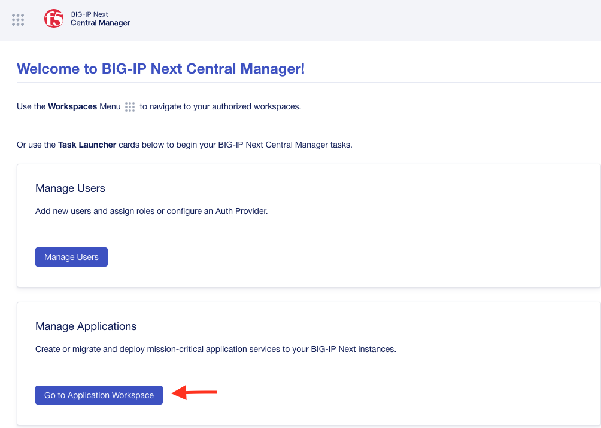

Then select **"Add Application"**

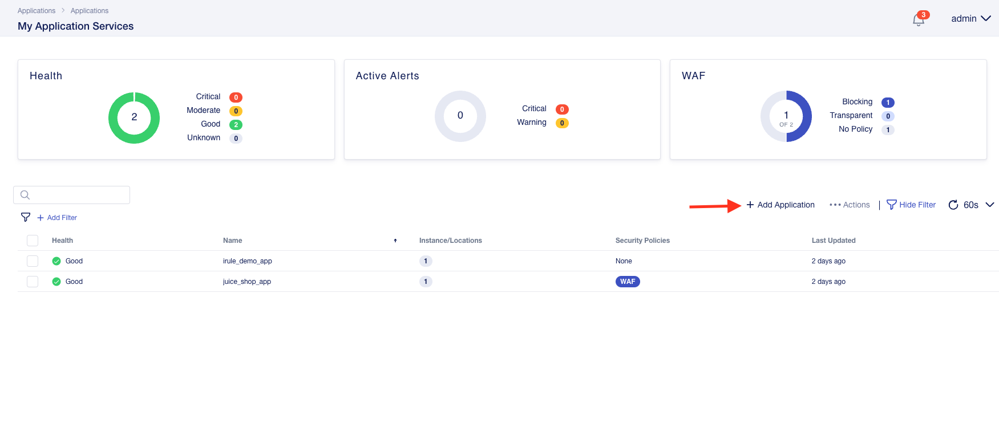

Select **"New Migration"** and enter the following information in General Propoerties:

* Session Name -

.. code-block:: console

   config-import

* Description -

.. code-block:: console

   Agility2023 BIG-IP Next Lab

Click **"Next"**

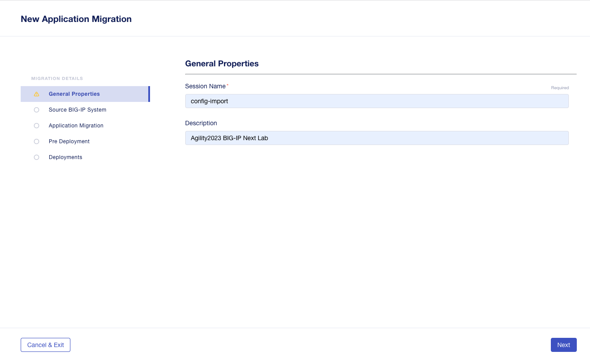

On the next step, you will select the the UCS file from the Ubuntu Jump Host Access Method

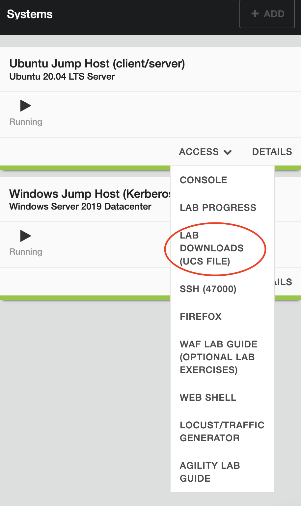
.. image:: ./lab4-downloads-ucs.png
        :scale: 25%

* Leave the **Master Key** and **Encrypted UCS Archives** options disabled.
* Make sure to select **Group by IP Addresses** as the group for Application Services and then Click **Next**

The UCS file uploaded successful and you are redirected to the **Appllication Migration** section

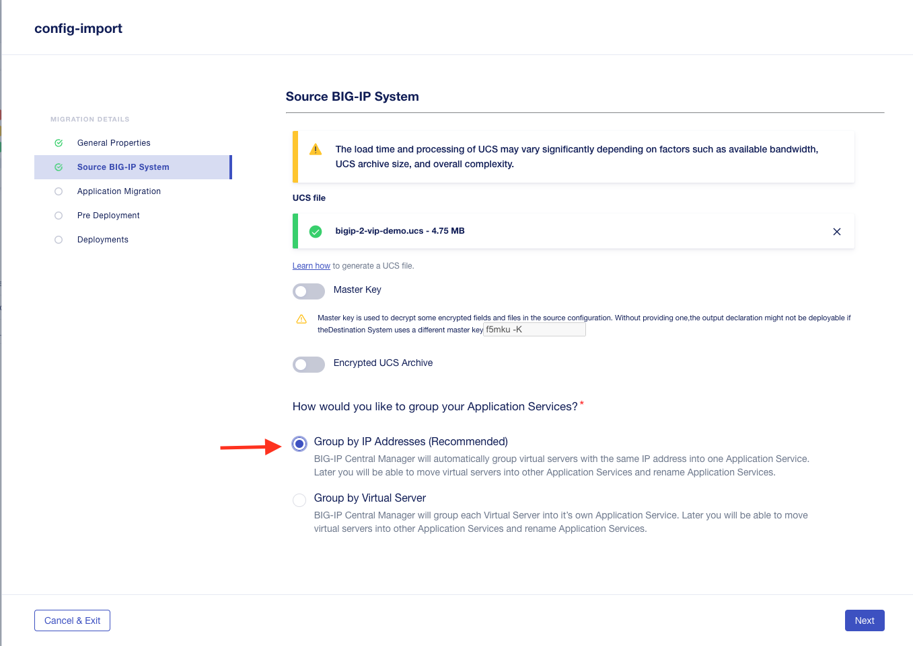

Select **"Add Application"** to import the applications from the UCS

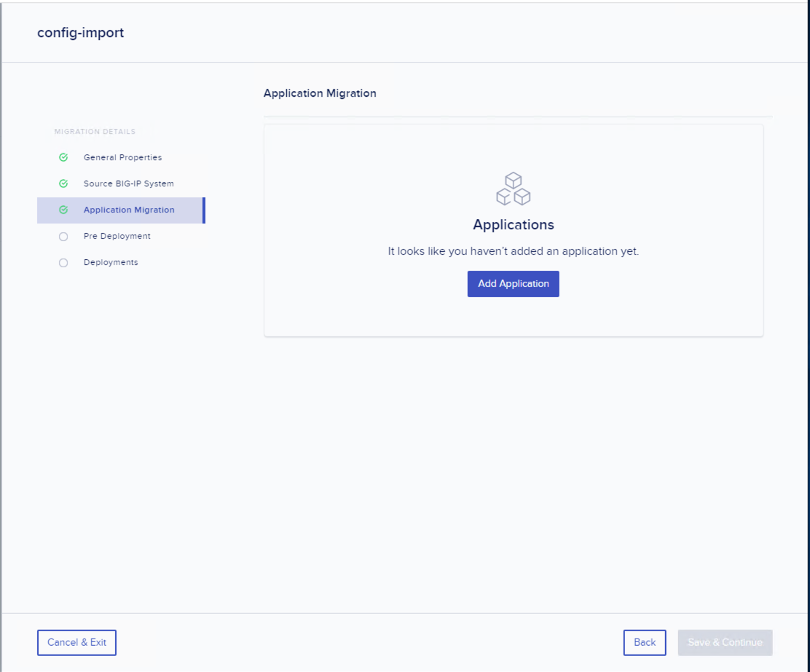

Select the 2 applications and click on **"Add"**

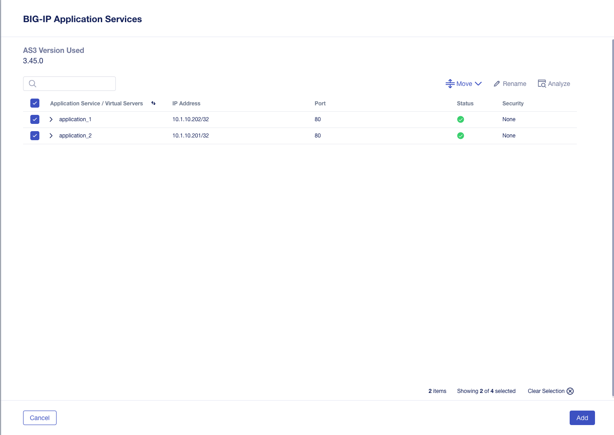

At the Application Migration menu, verify the 2 applications and click on **"Next"**

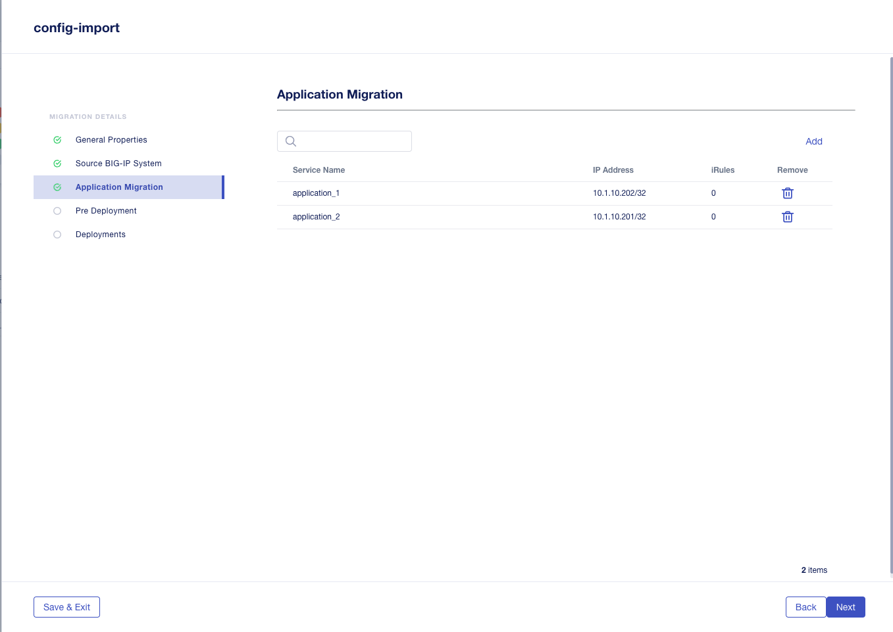

For the 2 application services, make sure the "Deploy Location" is set for  **big-ip-next-03.f5demo.com**

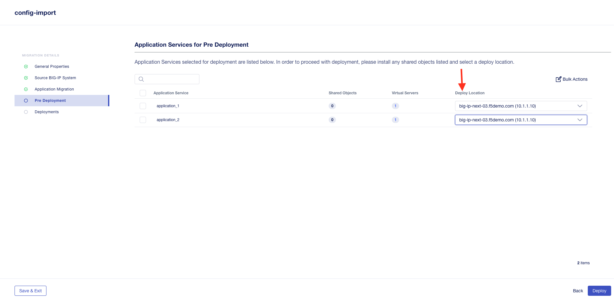

Then select **"Deploy"** and after about 30 seconds, both applications should showcase a green successful status icon.

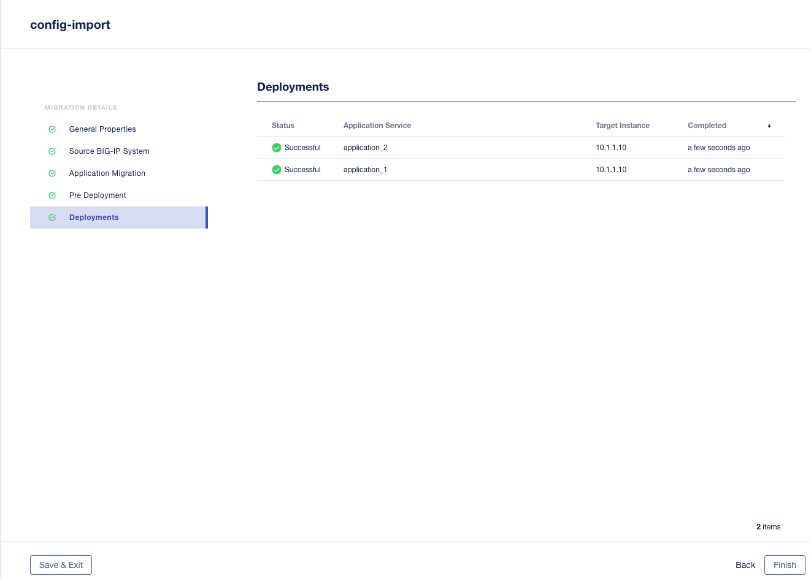

Click **Finish** and now at the My Apps screen you will be able to see the 2 new apps that you have imported.

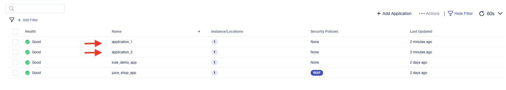
