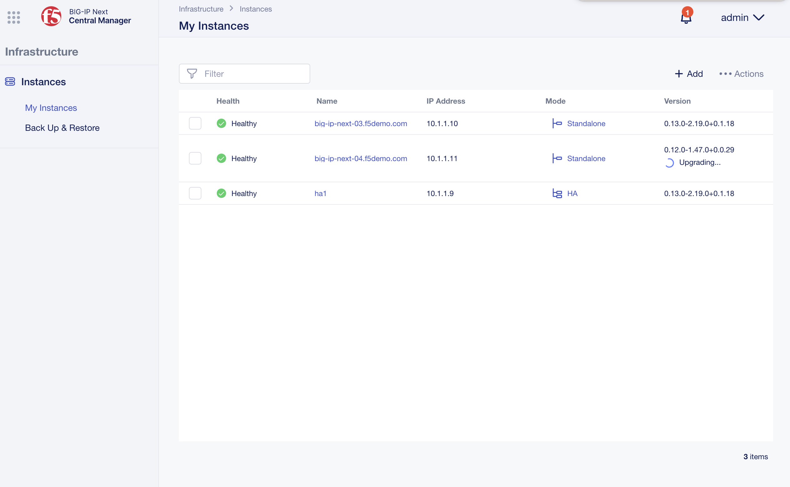

..
  Tami Skelton
  Updated: 10/10/2022.

How to: Upgrade a BIG-IP Next Standalone Instance on VE from BIG-IP Next Central Manager
=====================================================================================================

Overview
~~~~~~~~
Use this procedure to upgrade the software for a BIG-IP Next Standalone instance from BIG-IP Next Central Manager.

Procedure
~~~~~~~~~
#. Log in to BIG-IP Next Central Manager as *admin*, click the Workspace icon next to the F5 logo, and click **Infrastructure**.
#. Select the checkbox next to the BIG-IP Next instance (big-ip-next-04.f5demo.com) you want to upgrade.
#. At the top right of the screen, click **Actions** and select **Upgrade**.

   .. image:: ./lab6_upgrade_img01_instances_list_actions_menu.png
      :scale: 25%

   The upgrade instance dialog will come up.

   .. image:: ./lab6_upgrade_img02_initial.png
      :scale: 25%

#. For the image file, click **Select file** and then navigate to the available upgrade file available on the instance.
#. For the signature file, click **Select file** and then navigate to the available signature file available on the instance.

   .. image:: ./lab6_upgrade_img03_selected_file_upgrade_signature_file.png
      :scale: 25%

#. Click the **Upgrade** button.
#. You'll see an Upgrade Instance confirmation dialog come up. Click **Upgrade**.

   .. image:: ./lab6_upgrade_img04_upgrade_instance_confirm.png
      :scale: 25%

Result
~~~~~~
After the upgrade process, the BIG-IP Next instance displays with the new version on the **My Instances** page. While the upgrade process is being performed, you'll see indications of upgrade taking place.

