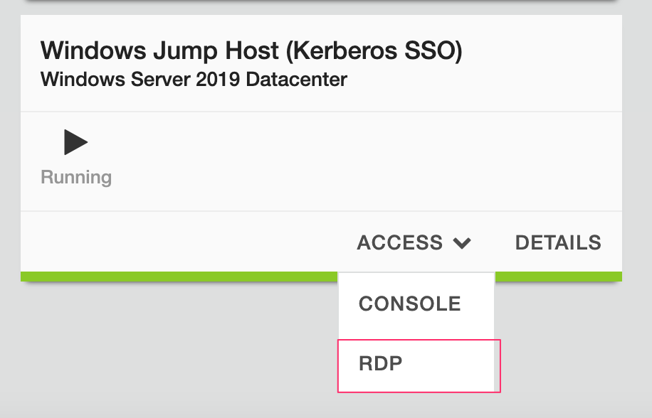
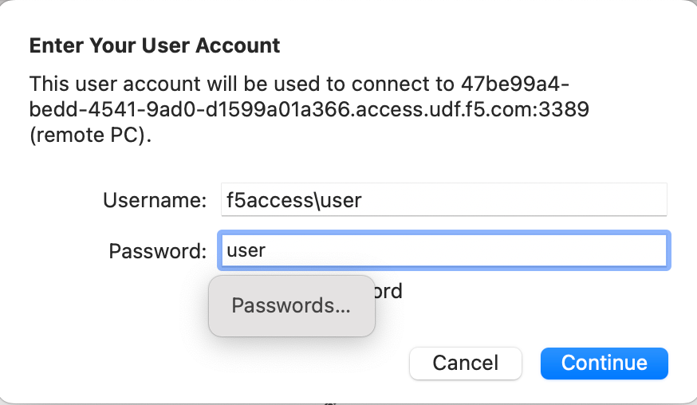
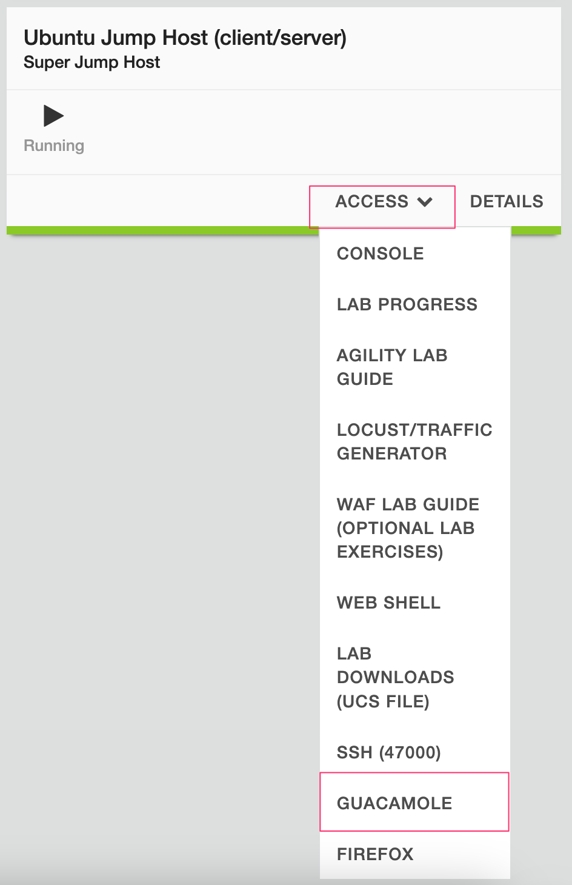
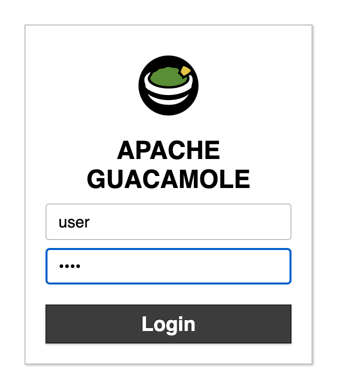
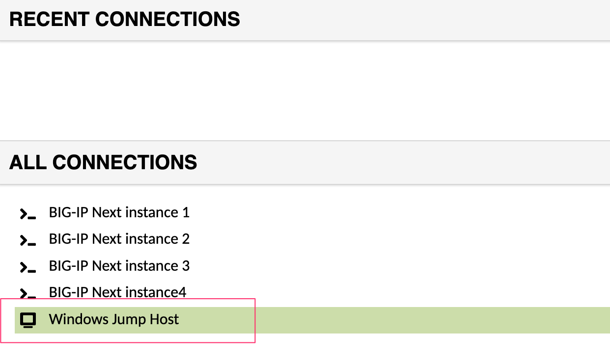

Lab 8.1 - Debug BIG-IP Next Instance
====================================

You can enable a Debug Session that will allow you to SSH to a BIG-IP Next instance to run network troubleshooting tools like ping and tcpdump.

In this lab exercise we will use a pre-created SSH key to configure a Debug Session on BIG-IP Next via Central Manager.

Once connected to the Debug Session we will inspect some basic network configuration, examine the isolation of the data plane process, and run some commands to observe live network traffic and logs.

8.1.1 - Start Debug Session
~~~~~~~~~~~~~~~~~~~~~~~~~~~

#. Click the workspace switcher next to the F5 icon, and click **Infrastructure**.

    .. image:: ../module2/lab2_img03_navigation_to_infrastructure2.png
		:scale: 25%

#. Click on the Name of BIG-IP Next instance "big-ip-next-03.f5demo.com"

#. Click on the **Debug** tab (you may need to scroll the window down to see Debug)

    .. image:: ./instance-3-select-debug.png
      :scale: 50%

#. You will see a screen that lists the requirements.  Click on **Proceed**

#. Copy the following SSH key (you can click on the Copy icon if you float your mouse to the top right of the text)

    .. code-block::

      ssh-rsa AAAAB3NzaC1yc2EAAAADAQABAAABAQC+Nn+twlYTptgkQRs9EKHtA8HfO177bdtxO6+bEXJc2DKGrEXlmfAlQz/PVQJy+iaDvP50HymDAevrZi0KwXajVBkK6KaESbcKK2vz5kvYRumOc5UrfxysyAaWHn/he7Uhft5TRakVQlolU+EaC2PDotMkeSkxBG893+CW57olxFxQgwcz8jF7MiftTV+HexmqTldCSrfOxRlaSu6n4hiXXgyth3247NACOUGU8I89XoEIWchdx6iEcF6inweUS0CNfChzRSI5fzLVLaacYB+MmljDGcKdz0MqP0VPs4aKUuLIGgsJqjajta8Raoj0Ws6PgABJo4U4DgDTelQXKtbZ f5debuguser

    *Illustration of how to copy the key into your clipboard*

    .. image:: copy-ssh-key.png
      :scale: 50%

#. Paste in the SSH key

    .. image:: paste-ssh-key.png
      :scale: 50%

    .. warning:: Verify that you only paste a single line into the text box.  A newline character will cause a format error.  Only a single SSH key can be entered

#. Click on **Start Debug Session**

    .. warning:: Only a single Debug Session can run on an instance at a time.

#. You should see a Prompt to SSH. We will be using the Putty SSH client to connect later in this lab from the Windows host in the lab environment.

    *You should see the following*

    .. code-block::

      ssh admin@10.1.1.10 -p 2222

8.1.2 - Connect to Windows Host
~~~~~~~~~~~~~~~~~~~~~~~~~~~~~~~

We will use a Putty SSH client that has been pre-configured with the SSH key that was previously used to start the Debug Session

To connect to the Windows Host there are two choices for clients that can be used, as not all attendees will be able to use Remote Desktop.

**Option 1.)** Log into the Windows Jumphost using the **RDP** option in the main UDF screen.

**Option 2.)** Use the Guacamole HTML based RDP client on the Ubuntu Jumphost (recommended for those that cannot install RDP).

**For Windows RDP users:**

Go to the UDF Deployment screen and select the **Access** dropdown for **Windows Jumphost**, then **RDP**. This will download an RDP shortcut to your machine.

Open the RDP shortcut to connect to the Windows Jumphost. Provide the credentials shown below and log in.

Username

.. code-block::

    f5access\user

Password

.. code-block::

    user

**For Guacamole (Non RDP) users:**

Go to the UDF Deployment screen, and select the **Access** dropdown for **Ubuntu Jumphost**, then **Guacamole**. This will open an HTML-based RDP client.

Provide the credentials shown below and log in.

Username

.. code-block::

    user

Password

.. code-block::

    user

Then select the **Windows Jumphost** option.

8.1.3 - Connect to Debug Session
~~~~~~~~~~~~~~~~~~~~~~~~~~~~~~~~

#. Launch Putty. The Putty SSH client should be located on the bottom left of the screen.

    .. image:: launch-putty.png
      :scale: 50%

#. Select and load the *big-ip-next-instance-3-debug* profile. This session has been pre-configured with the SSH key that was used to start the Debug Session and to connect to instance 3 at the IP address 10.1.1.10 via port 2222.

    .. image:: ./load-putty-session.png
      :scale: 50%

#. Click on **Open**

#. Accept SSH Host Key (click on Accept). You must accept the SSH Host key to connect.

#. You should now see the following:

    .. code-block::

      Using username "admin".
      Authenticating with public key "f5debuguser"
      Warning: Permanently added '[100.76.0.27]:2222' (ECDSA) to the list of known hosts.
      ****************************************
      *                                      *
      * Welcome to BIG-IP Next Debug Console *
      *                                      *
      ****************************************
      /

8.1.3 - Debug Session Isolation
~~~~~~~~~~~~~~~~~~~~~~~~~~~~~~~

The debug session runs in an isolated environment that has limited visibility to the platform.

#. Run the command ``ps aux`` and you should see a limited number of processes.

    .. code-block:: bash

      /ps aux
      USER         PID %CPU %MEM    VSZ   RSS TTY      STAT START   TIME COMMAND
      f5docker       1  0.0  0.0 711900  1980 ?        Ssl  16:01   0:00 /init
      f5docker      24  0.0  0.0   3044  1256 ?        S    16:01   0:00 s6-svscan -c3
      f5docker      28  0.0  0.0   3056  1244 ?        S    16:01   0:00 s6-supervise
      f5docker      29  0.0  0.0   2920   992 ?        Ss   16:01   0:00 /bin/sh -e /u
      f5docker      30  0.0  0.0 711916  8192 ?        Sl   16:01   0:00 /usr/bin/qkvi
      root          54  0.0  0.0  15420  5368 ?        Ss   16:01   0:00 sshd: /usr/sb
      f5docker      59  0.0  0.0   2920   208 ?        S    16:01   0:00 /bin/sh -e /u
      f5docker      61  0.0  0.0   3020  1208 ?        S    16:01   0:00 inotifywait -
      f5docker      63  0.0  0.0   3020  1204 ?        S    18:58   0:00 inotifywait -
      root          64  0.0  0.0  15896  9692 ?        Ss   18:58   0:00 sshd: debugus
      debugus+      68  0.0  0.0  16156  7040 ?        D    18:58   0:00 sshd: debugus
      debugus+      69  0.0  0.0   4624  3800 pts/0    Ss   18:58   0:00 -bash
      debugus+      74  0.0  0.0   7060  1548 pts/0    R+   19:02   0:00 ps aux
      /

8.1.3 - Debug Session View Config
~~~~~~~~~~~~~~~~~~~~~~~~~~~~~~~~~

The Debug Session has access to viewing information about the data-plane.

#. Run the command ``ip a``

    You will see an output that includes the data-plane VLANs and self-IPs that have been configure on this device.

      .. note:: This is an interpretation of what the data-plane process sees and not all counters may reflect true values like MTU and state.

    .. code-block:: bash

      /ip a
      ...
      5: vlan-3000: <BROADCAST,MULTICAST,UP,LOWER_UP> mtu 1500 qdisc fq_codel state UNKNOWN group default qlen 1000
          link/ether 52:54:00:05:55:cc brd ff:ff:ff:ff:ff:ff
          inet 10.1.20.10/24 brd 10.1.20.255 scope global vlan-3000
            valid_lft forever preferred_lft forever
          inet6 fe80::5054:ff:fe05:55cc/64 scope link
            valid_lft forever preferred_lft forever
          inet6 fe80::841d:11ff:fe41:1d5d/64 scope link
            valid_lft forever preferred_lft forever
      6: vlan-4000: <BROADCAST,MULTICAST,UP,LOWER_UP> mtu 1500 qdisc fq_codel state UNKNOWN group default qlen 1000
          link/ether 52:54:00:e3:b3:76 brd ff:ff:ff:ff:ff:ff
          inet 10.1.10.10/24 brd 10.1.10.255 scope global vlan-4000
            valid_lft forever preferred_lft forever
          inet6 fe80::5054:ff:fee3:b376/64 scope link
            valid_lft forever preferred_lft forever
          inet6 fe80::6c2c:25ff:fefe:3dd4/64 scope link
            valid_lft forever preferred_lft forever

8.1.4 - Debug Session Basic Commands
~~~~~~~~~~~~~~~~~~~~~~~~~~~~~~~~~~~~

In the following exercise we will review how you can use ping, tcpdump, and view logs from the data-plane (TMM)

#. Run the command ``ping -c 4 10.1.20.4``

    You should see the following output.  The traffic is originating from the 10.1.20.10 self-ip.

    .. code-block:: bash

      /ping -c 4 10.1.20.4
      PING 10.1.20.4 (10.1.20.4) 56(84) bytes of data.
      64 bytes from 10.1.20.4: icmp_seq=1 ttl=64 time=4.76 ms
      64 bytes from 10.1.20.4: icmp_seq=2 ttl=64 time=1.50 ms
      64 bytes from 10.1.20.4: icmp_seq=3 ttl=64 time=2.17 ms
      64 bytes from 10.1.20.4: icmp_seq=4 ttl=64 time=1.90 ms

      --- 10.1.20.4 ping statistics ---
      4 packets transmitted, 4 received, 0% packet loss, time 3004ms
      rtt min/avg/max/mdev = 1.503/2.584/4.758/1.277 ms
      /

#. Run the command ``tcpdump -i vlan-3000 port 3000 -c 4``

    .. code-block:: bash

      /tcpdump -i vlan-3000 port 3000 -c 4
      tcpdump: verbose output suppressed, use -v[v]... for full protocol decode
      listening on vlan-3000, link-type EN10MB (Ethernet), snapshot length 65535 bytes
      19:41:01.486963 IP 10.1.20.10.58506 > 10.1.20.101.3000: Flags [S], seq 2794701663, win 23360, options [mss 1460,nop,wscale 0,sackOK,TS val 2589746862 ecr 0], length 0 out slot1/tmm2 lis=mon_ivs_http port=1.2 trunk=
      19:41:01.488439 IP 10.1.20.101.3000 > 10.1.20.10.58506: Flags [S.], seq 3304685922, ack 2794701664, win 65160, options [mss 1460,sackOK,TS val 501170450 ecr 2589746862,nop,wscale 7], length 0 in slot1/tmm2 lis=mon_ivs_http port=1.2 trunk=
      19:41:01.488548 IP 10.1.20.10.58506 > 10.1.20.101.3000: Flags [.], ack 1, win 23360, options [nop,nop,TS val 2589746863 ecr 501170450], length 0 out slot1/tmm2 lis=mon_ivs_http port=1.2 trunk=
      19:41:01.488577 IP 10.1.20.10.58506 > 10.1.20.101.3000: Flags [P.], seq 1:46, ack 1, win 23360, options [nop,nop,TS val 2589746863 ecr 501170450], length 45 out slot1/tmm2 lis=mon_ivs_http port=1.2 trunk=
      4 packets captured
      4 packets received by filter
      0 packets dropped by kernel

    .. tip:: You can also use 0.0 to listen on all interfaces or the interface name (1.2)

#. Run the command ``tail -4 /logs/f5-fsm-tmm-0.log``

    This will allow you to see the last 4 entries from the TMM log (/var/log/ltm)

    The format is compatible with OpenTelemetry

    .. code-block::

      /tail -4 /logs/f5-fsm-tmm-0.log
      {"ts":"2023-09-15 19:40:54.167656 UTC","ct":"f5-fsm-tmm","stream":"0","scid":"unknown","sysid":"d38ea2dc-ac9a-4731-8618-b371d56ffb1d","log":"\u003c133\u003eSep 15 19:40:54 f5-fsm-tmm-569897896c-6wsnh tmm[8]: 013e0002:5: \"v\"=\"1.0\";\"lt\"=\"T\";\"l\"=\"notice\";\"LocalAddress\"=\"169.254.0.1\";\"LocalPort\"=\"2\";\"RemoteAddress\"=\"169.254.0.253\";\"RemotePort\"=\"46927\";\"m\"=\"Tcpdump stopping on 169.254.0.1:2 from 169.254.0.253:46927\""}
      {"ts":"2023-09-15 19:41:00.269114 UTC","ct":"f5-fsm-tmm","stream":"0","scid":"unknown","sysid":"d38ea2dc-ac9a-4731-8618-b371d56ffb1d","log":"\u003c133\u003eSep 15 19:41:00 f5-fsm-tmm-569897896c-6wsnh tmm[8]: 013e0000:5: \"v\"=\"1.0\";\"lt\"=\"T\";\"l\"=\"notice\";\"LocalAddress\"=\"169.254.0.1\";\"LocalPort\"=\"2\";\"RemoteAddress\"=\"169.254.0.253\";\"RemotePort\"=\"46483\";\"m\"=\"Tcpdump starting locally on 169.254.0.1:2 from 169.254.0.253:46483\""}
      {"ts":"2023-09-15 19:41:00.269447 UTC","ct":"f5-fsm-tmm","stream":"0","scid":"unknown","sysid":"d38ea2dc-ac9a-4731-8618-b371d56ffb1d","log":"\u003c133\u003eSep 15 19:41:00 f5-fsm-tmm-569897896c-6wsnh tmm[8]: 013e000b:5: \"v\"=\"1.0\";\"lt\"=\"T\";\"l\"=\"notice\";\"DPTProviderName\"=\"Noise Provider \";\"m\"=\"Tcpdump starting DPT providers:Noise Provider \""}
      {"ts":"2023-09-15 19:41:02.269566 UTC","ct":"f5-fsm-tmm","stream":"0","scid":"unknown","sysid":"d38ea2dc-ac9a-4731-8618-b371d56ffb1d","log":"\u003c133\u003eSep 15 19:41:02 f5-fsm-tmm-569897896c-6wsnh tmm[8]: 013e0002:5: \"v\"=\"1.0\";\"lt\"=\"T\";\"l\"=\"notice\";\"LocalAddress\"=\"169.254.0.1\";\"LocalPort\"=\"2\";\"RemoteAddress\"=\"169.254.0.253\";\"RemotePort\"=\"46483\";\"m\"=\"Tcpdump stopping on 169.254.0.1:2 from 169.254.0.253:46483\""}

    .. tip:: You could also use ``tail -f`` to see a live / streaming view of the logs

8.1.5 - Stop Debug Session
~~~~~~~~~~~~~~~~~~~~~~~~~~

#. Go back to Central Manager and click on **Stop Debug Session**

    This should cause your Putty session to end

**This concludes the BIG-IP Next opertional debugging lab. Thank you!**
